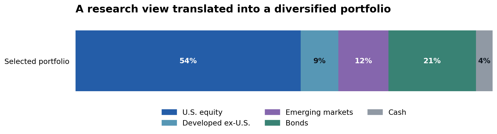
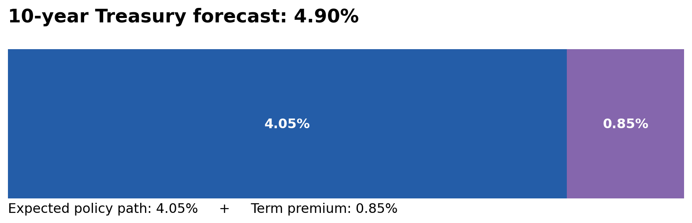
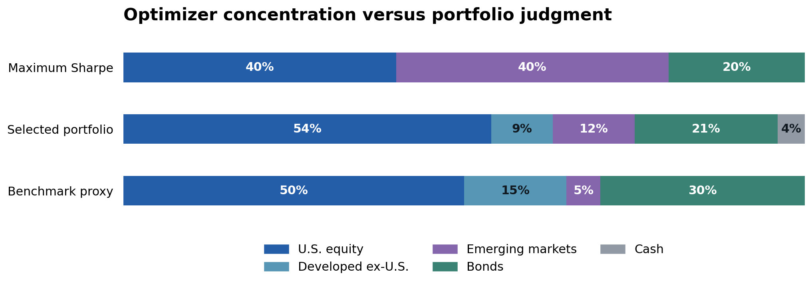
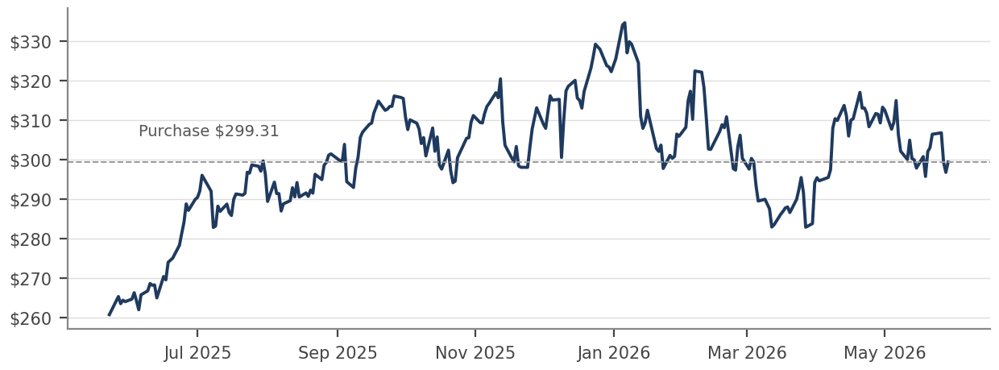
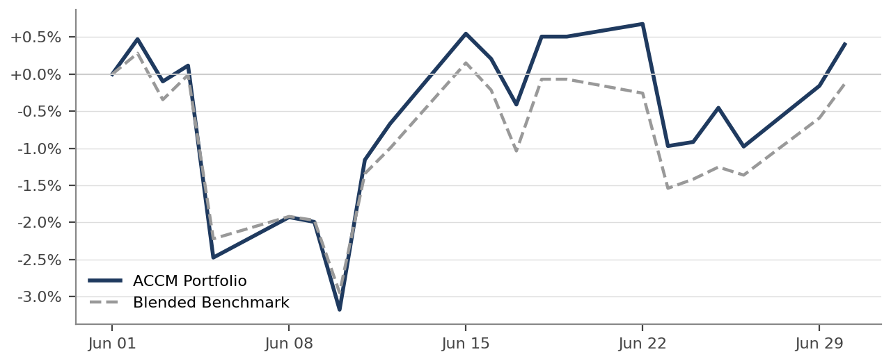

# Applied Portfolio Management & Investment Research

An academic investment research project connecting macroeconomic forecasting, constrained portfolio optimization, and equity valuation within a hypothetical $1 million multi-asset mandate.

The central question: How should an economic outlook translate into a portfolio, and what evidence would justify changing it?

Excel · Bloomberg · Economic Research · Portfolio Optimization · Risk Analysis · Equity Valuation

Figure 1 · Selected portfolio weights and analytical scope. Source: revised Final Portfolio Report, Asset Allocation and Portfolio Construction sections.

[Full portfolio report](reports/portfolio-report.pdf) · [Explore the Excel models](models/) · [JPMorgan research](reports/jpm-equity-research.pdf)

Prepared by Andrew Pasten for FRL 6950, Applied Portfolio Management, Cal Poly Pomona. Angel City Capital Management is a fictitious firm created for the course. This is academic work, not an actual client mandate or investment advice.

[Overview](#project-at-a-glance) · [Economic research](#economic-research-building-the-investment-view) · [Construction](#portfolio-construction-optimization-and-judgment) · [Risk & validation](#risk-analysis-validation-and-model-limitations) · [JPMorgan](#equity-research-jpmorgan-chase) · [Results](#performance-evaluation-and-ongoing-monitoring) · [Materials](#project-materials)

## Project at a Glance

| Item | Scope |
| --- | --- |
| Objective | Develop an economic outlook, translate it into expected returns, and construct a portfolio within a written investment policy. |
| Client framework | Hypothetical endowment-style institution with a long investment horizon and moderate-to-high risk tolerance. |
| Benchmark | 50% Russell 3000 / 20% MSCI ACWI ex-U.S. / 30% Bloomberg U.S. Aggregate. |
| Research components | GDP and inflation modeling; interest-rate decomposition; portfolio optimization; sector and fund selection; JPMorgan valuation; performance monitoring. |
| Historical risk inputs | Monthly asset-class total returns, June 2016 to May 2026. |
| Evaluation period | June 2026 portfolio evaluation, with subsequent research updates and an economic-model freeze dated July 31, 2026. |
| Deliverables | Portfolio report, equity research report, and four supporting Excel workbooks. |

### Analytical Approach

- **Build the economic view.** Link growth, inflation, and interest-rate expectations to explicit inputs and assumptions.

- **Estimate asset-class returns.** Translate the outlook into equity, bond, and cash return assumptions.

- **Optimize within policy.** Combine forward-looking expected returns with historical covariance and allocation constraints.

- **Apply investment judgment.** Adjust concentrated model outputs and document the trade-offs.

- **Implement and evaluate.** Select instruments, analyze individual securities, and monitor return, risk, and thesis changes.

## Economic Research: Building the Investment View

The project examines a **higher-for-longer interest-rate scenario**: inflation remains persistent, nominal growth supports corporate activity, and longer-term yields remain elevated. The relevant portfolio question is how these conditions affect expected returns and risk across asset classes.

The revised report distinguishes forecast horizons: its inflation build remains near 3.4%, roughly 40 basis points above consensus over the project’s twelve-month window. It compares that persistence with a consensus forecast of 2.5% by 2027. The thesis concerns how slowly inflation fades, rather than stronger real growth.

The model builds nominal GDP from consumption, investment, government spending, and net trade. A labor-and-materials inflation estimate supports the real-growth calculation, while a separate interest-rate model examines the expected policy path and term premium.

| Model output | Project forecast | Portfolio relevance |
| --- | --- | --- |
| Nominal GDP growth | 5.24% | Revenue and earnings assumptions |
| Real GDP growth | Approximately 1.8 to 2.2% | Judgmental range; CPI-style deflation is an approximation |
| Inflation estimate | 3.43% | Policy persistence and cost pressures |
| 10-year Treasury yield | 4.90% | Bond return assumptions and equity valuations |
| Unemployment | 4.39% | Labor-market and consumption outlook |

Project forecasts, not realized outcomes or current market estimates. Summary values follow the supplied economic-model summary; the full report discusses the underlying assumptions and later data updates.

Figure 2 · Forecast decomposition described in the revised portfolio report. The framework draws on the New York Fed’s Adrian, Crump and Moench term-premium model. These are forecast components, not a contemporaneous market quote.

### Research detail: inputs, adjustments, and cross-checks

- **Consumption:** labor-market inputs, wage growth, and saving behavior inform spending assumptions.

- **Business investment:** national-accounts data are compared with company capital-expenditure disclosures to evaluate the investment narrative.

- **Data adjustments:** tariff-related inventory and import effects are documented separately from source data so the modeling choices remain visible. These are analyst adjustments, not a claim that official GDP accounting is erroneous.

- **Interest rates:** the model separates expected policy rates from compensation for holding longer-maturity bonds.

- **Benchmarking:** external forecasts provide a reasonableness check; comparisons require matching forecast horizons and observation dates.

The economic workbook includes dedicated sections for source data, adjustments, period alignment, benchmarking, commodity refreshes, and limitations.

### Connecting the View to Portfolio Decisions

| Research view | Implementation | What could undermine it? |
| --- | --- | --- |
| Persistent inflation and elevated yields | Fixed-income duration below the broad bond benchmark | Rapid disinflation and a strong rally in longer-duration bonds |
| Resilient nominal activity | Financials and Industrials exposure; researched JPM position | Credit deterioration or weaker business spending |
| AI infrastructure investment | Industrial, energy, and financing exposure | Capital-spending cuts and correlated losses across these holdings |
| Attractive modeled EM returns | Emerging-market overweight, moderated to 12% | Forecast error, currency risk, or political shocks |

## Portfolio Construction: Optimization and Judgment

The allocation process uses 120 months of historical returns to estimate covariance, then substitutes the project's forward-looking expected returns for historical mean returns. The optimizer evaluates allocations subject to investment-policy constraints.

Under those assumptions, the maximum-Sharpe solution allocates **40% to emerging markets** and eliminates developed international equities. The selected portfolio reduces emerging markets to **12%**, restores developed-market exposure, and retains a cash reserve.

This adjustment accepts a lower modeled return and Sharpe ratio in exchange for less dependence on a single asset-class forecast. Historical covariance and point estimates do not fully represent estimation uncertainty, political risk, or currency exposure.

Figure 3 · Allocations reported in the optimizer comparison. The benchmark proxy splits its 20% international-equity weight into 15% developed and 5% emerging markets; this is the project's modeling approximation.

| Scenario | Expected annual return | Annualized volatility | Expected Sharpe |
| --- | --- | --- | --- |
| Maximum Sharpe | 6.48% | 12.65% | 0.220 |
| Minimum volatility | 5.02% | 9.32% | 0.141 |
| Selected allocation | 5.62% | 11.74% | 0.163 |
| Benchmark proxy | 5.17% | 11.22% | 0.131 |

Reported asset-class model outputs, rounded. Sharpe ratios use a 3.7% cash assumption. The updated implementation forecast is approximately 5.78% before JPM selection and 6.27% including it, versus 5.19% for the corresponding benchmark. The implied active return is approximately 108 basis points. These implementation estimates are separate from the asset-class returns and Sharpe ratios above.

### Selected allocation, instruments, and policy constraints

| Sleeve | Weight / target dollars | Implementation |
| --- | --- | --- |
| U.S. equities | 54% / $540,000 | GICS sector ETFs and JPM |
| Developed ex-U.S. | 9% / $90,000 | IEFA |
| Emerging markets | 12% / $120,000 | IEMG |
| Fixed income | 21% / $210,000 | SPTI, FBND, HYG, JMBS |
| Cash equivalents | 4% / $40,000 | BIL |

- Total equities: 60 to 80%; fixed income: 20 to 40%; cash: 0 to 20%.

- Foreign equity: no more than 50% of the equity sleeve. The selected portfolio uses 21% of total assets, or 28% of equities.

- Individual-stock positions: maximum 5% of the portfolio. Broad funds and sector ETFs are treated separately.

- The target allocations total $1 million; implemented holdings can differ slightly because of share rounding.

### Sector and fixed-income implementation

U.S. sector weights begin with benchmark composition and are adjusted to express the macro thesis. Financials, Industrials, and Energy are prominent active exposures; the portfolio also retains substantial Technology exposure.

The bond sleeve combines Treasury, broad bond, high-yield, and mortgage-backed-security funds. The report evaluates fees, liquidity, yield, duration, and the case for active versus passive management. Using the dated comparison in the revised report’s fixed-income section, the sleeve has approximately 5.1 years of duration versus 5.8 years for the AGG benchmark proxy, based on July 1, 2026 data.

The intended trade-off is lower rate sensitivity with income from credit and mortgage exposure. Those exposures introduce credit-spread, prepayment, and extension risks that duration alone does not capture.

## Risk Analysis, Validation, and Model Limitations

The project evaluates both **portfolio risk** and **the reliability of the assumptions used to build it.** A diversified allocation can still depend on a concentrated economic thesis.

| Risk | Why it matters | Assessment or control |
| --- | --- | --- |
| Expected-return error | Small forecast changes can materially shift optimizer weights. | Compare alternative solutions and moderate concentrated allocations. |
| Shared economic exposure | Several sectors may depend on the same investment-spending cycle. | Review exposure across holdings, not only individual position weights. |
| Interest rates and credit | Shorter duration reduces one risk but does not remove spread or default risk. | Evaluate duration, credit quality, yield, and fund roles together. |
| Individual security | JPM earnings, capital returns, and credit outcomes may diverge from the thesis. | 5% position limit and documented review or sell conditions. |
| Data timing | Later observations can contaminate an earlier investment evaluation. | Distinguish inception assumptions, June results, and July research updates. |

### Cross-Checking Performance

The project uses Excel models with economic and market inputs to develop the allocation and evaluate results. Bloomberg portfolio analytics provide the reported portfolio and benchmark performance. The models document the assumptions connecting the economic outlook to the selected holdings.

### Known limitations and how they affect interpretation

- **Inflation specification:** the labor-and-materials weighting is a production-cost proxy, not a full CPI expenditure basket. Shelter is omitted, limiting its interpretation as a consumer-price forecast.

- **Commodity inputs:** oil has a substantial model weight, and futures prices reflect more than expected future spot prices.

- **Historical risk estimates:** a ten-year covariance matrix does not guarantee that future correlations and volatility will remain stable.

- **Investment concentration:** multiple sector positions can be exposed to the same hyperscaler capital-spending assumptions.

- **Source dates:** the revised report dates its main market observations through July 23, 2026 and freezes the economic model at July 31. The July 25 commodity refresh is documented separately as a rejected sensitivity exercise.

- **Evaluation length:** one month of returns cannot establish persistent alpha or validate an investment strategy.

## Equity Research: JPMorgan Chase

JPMorgan provides a company-level application of the portfolio thesis. The research connects nominal activity and financing demand to the bank's earnings mix, examines credit and capital-return risks, and develops a valuation using **dividends plus net share repurchases**.

| Research item | Project assumption or conclusion |
| --- | --- |
| Initiation reference price | $299.31, May 29, 2026 close |
| Project recommendation | Buy, subject to the stated assumptions and review conditions |
| 12-month target | $341.58, rounded to $342, for June 1, 2027; approximately 14.1% price upside and 16.1% modeled total return |
| Position sizing | 5% of the target portfolio |
| Valuation method | Total-payout dividend growth model |

JPMorgan Price History at Initiation

Original chart extracted from the current Final Portfolio Report; also included in the JPMorgan Equity Research Report. Trailing twelve months through May 29, 2026, with the $299.31 purchase reference.

### Valuation Mechanics

CAPM provides an estimated cost of equity of **8.88%**, using a 4.45% risk-free rate, approximately 0.99 beta, and a 4.48% equity risk premium. The model uses a 4.45% perpetual growth assumption and a historical average shareholder-payout ratio of approximately 65.4%.

Equity value = Expected shareholder cash flow ÷ (Cost of equity − Growth rate)

Applying the payout assumption to forecast earnings estimates the cash available to shareholders. The model values each share at $321.15 on January 1, 2026, then compounds that value at the 4.45% growth assumption for 17 months to June 1, 2027. The resulting $341.58 target is twelve months beyond the June 1, 2026 initiation date.

Valuation scenarios

Project estimates per share · Not probabilities or current price targets

| Bear | Base | Bull |
| --- | --- | --- |
| **$250** | **$342** | **$381** |

Scenario values from the portfolio report. The supporting model contains the scenario assumptions and sensitivity analysis.

### Assumptions that deserve scrutiny

Net buybacks are a material share of modeled shareholder cash flow, so payout sustainability and capital requirements matter. A narrow gap between the discount rate and perpetual growth rate makes valuation sensitive to the chosen assumptions.

Setting growth equal to the risk-free rate causes that rate to cancel from the capitalization spread under the model's linked assumptions. This does not make the bank economically insensitive to rates, and changes to earnings, payout, or forward valuation timing can still alter the target.

### Review and sell criteria

- Reassess valuation if the price reaches the target without a corresponding improvement in fundamentals.

- Review sustained card net charge-offs above approximately 4% or nonperforming assets above 1.25% of loans.

- Reassess the thesis if recession or rapid easing undermines the assumed earnings environment.

- Investigate an unexplained decline of more than 20% from the reference purchase price.

- Review position size and trim policy breaches at rebalancing.

These are academic investment-policy rules documented in the project, not personal investment recommendations.

## Performance Evaluation and Ongoing Monitoring

The June evaluation compares the academic portfolio with its blended benchmark. Results are presented separately from forward-looking expected returns and subsequent model updates.

Portfolio Performance Versus the Benchmark

Original chart extracted from the current Final Portfolio Report. Cumulative June 2026 total return. The report identifies Bloomberg PORT daily series as the source.

### June 2026 reported total returns

| Academic portfolio | Blended benchmark | Active return |
| --- | --- | --- |
| +0.40% | −0.13% | +53 bp |

Bloomberg PORT figures recorded in the workbook are +0.401%, −0.130%, and +0.531%, respectively. These displayed returns round that single series consistently.

The report identifies JPMorgan and Industrials as positive contributors and Technology and Communication Services as important detractors. These observations help assess how the positions behaved during the evaluation period; they do not establish durable skill.

### Reported holding contributions

| Holding or exposure | Contribution to portfolio return |
| --- | --- |
| JPMorgan | +52 bp |
| Industrials | +52 bp |
| Health Care | +25 bp |
| Financials ETF | +19 bp |
| Technology | −50 bp |
| Communication Services | −35 bp |
| Emerging markets | −24 bp |
| Energy | −16 bp |

Selected contributions reported in the June review. This is not an exhaustive attribution table and the entries are not active-return contributions versus the benchmark.

### Monitoring Framework

| Cadence | Review |
| --- | --- |
| Monthly | Return versus benchmark, attribution, allocation drift, risk exposures, and holding-specific developments. |
| Event-driven | Major inflation, policy, credit, or geopolitical developments that could change the thesis. |
| Six-month check / annual review | Reassess allocation and rebalancing needs within investment-policy limits. |
| Quarterly reporting | Summarize results, risks, positioning, trades, and changes to the outlook. |

Relative tolerance bands support rebalancing decisions, but hard investment-policy limits take precedence. Each proposed change should have a documented reason tied to risk, valuation, or the economic view.

### Timeline and interpretation of the evidence

| Period | Role in the project |
| --- | --- |
| June 2016 to May 2026 | Historical asset-class sample used for covariance estimation. |
| May 29 / June 1, 2026 | JPM reference price and portfolio inception framework. |
| June 2026 | Reported portfolio performance evaluation. |
| July 2026 updates | Market observations through July 23; a July 25 commodity sensitivity is considered and rejected in the economic model. |
| July 31, 2026 | Stated economic-model freeze. |

Later research explains how the analysis evolved. It does not establish that those observations were available at portfolio inception. The supplied materials use both “live” and “backtest” language; this page therefore describes the results as an academic portfolio evaluation.

## Technical Implementation and Skills Demonstrated

### Research and Modeling

- Component-based economic forecasting

- Interest-rate decomposition

- Forward-looking return assumptions

- Constrained mean-variance optimization

- Total-payout equity valuation

### Risk and Communication

- Concentration and diversification analysis

- Scenario and sensitivity interpretation

- Benchmark-relative performance review

- Data-vintage and model-limitations documentation

- Investment-policy and research reporting

**Excel** holds the economic, allocation, valuation, and historical-analysis models. **Bloomberg** supports market inputs, screening, portfolio analytics, and the reported performance evaluation. The analytical workflow is documented through the Excel workbooks and written reports.

## Project Materials

Start with this README, then explore the reports and supporting models.

| Material | Contents |
| --- | --- |
| [Full portfolio report (PDF)](reports/portfolio-report.pdf) | Policy, economic outlook, construction, risk, valuation and performance. |
| [JPMorgan equity research (PDF)](reports/jpm-equity-research.pdf) | Investment thesis, financial analysis, valuation and risks. |
| [Economic and inflation model](models/economic-inflation-model.xlsx) | Component forecasts, sources, adjustments, rates and limitations. |
| [Portfolio allocation workbook](models/portfolio-allocation.xlsx) | Holdings, expected returns, policy constraints and optimization. |
| [JPM valuation model](models/jpm-valuation.xlsx) | Total-payout valuation, scenarios and sensitivity analysis. |
| [Fixed-income and style analysis](models/fixed-income-style-analysis.xlsx) | Historical returns, volatility, correlations and fund inputs. |

Editable Word reports: [Portfolio report](reports/editable/portfolio-report.docx) · [JPM research](reports/editable/jpm-equity-research.docx).

### Reading and Reproducibility

The reports can be read without Excel or Bloomberg. The workbooks provide model inputs, calculations and assumptions. The optimizer carries forward a covariance matrix from earlier coursework; the original five return series are not included, so that matrix cannot be independently reconstructed from this package. Refreshing Bloomberg inputs requires authorized access.

### Sources and Attribution

Sources documented in the project include Bloomberg, BEA, BLS, FRED, the Federal Reserve, the New York Fed, SEC filings, JPMorgan investor materials, index providers and fund sponsors. Source dates and assumptions are retained in the reports and workbooks.

Prepared by Andrew Pasten for FRL 6950: Applied Portfolio Management, Cal Poly Pomona. Forecasts, valuation targets and portfolio conclusions are academic analysis.
